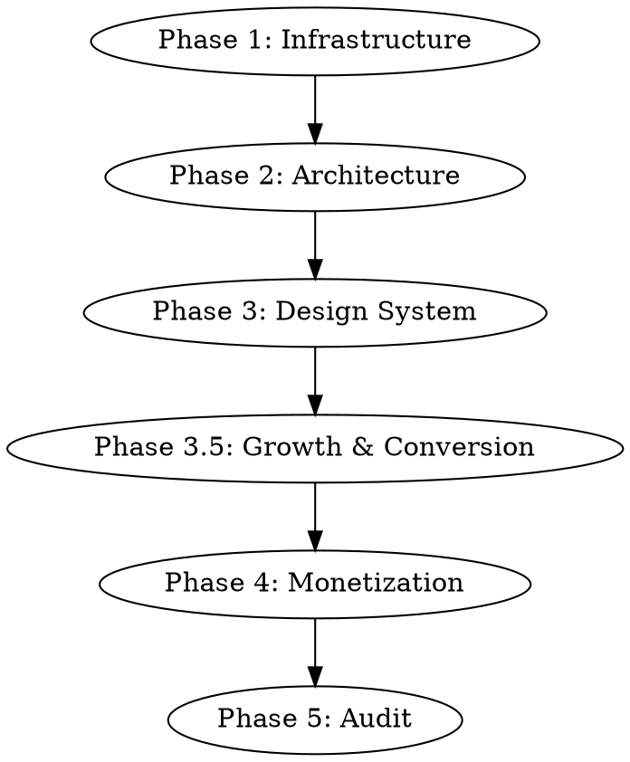

# Premium Android Setup

Master orchestrator for transforming any Android project into a premium, production-ready app. Walks through infrastructure, architecture, design system, monetization, and final audit.

## Prerequisites

Before starting, verify:
- Android Studio installed with Gradle 8.5+
- JDK 17+
- Tuist CLI installed (`tuist version` — install via `curl -Ls https://install.tuist.io | bash`)
- nova-canvas MCP configured (for Bedrock asset generation)
- **Marketing skills plugin enabled:** Enable the `marketing-skills` plugin from this marketplace. These skills are invoked during Phase 3.5 for conversion optimization.

## Orchestration Flow

Follow these phases in order. Use sequential-thinking MCP for design decisions at each step.



---

## Phase 1 — Infrastructure Setup

### 1.1 Tuist for Gradle

Initialize Tuist in the project root:
```bash
tuist init
```

Apply the Tuist Gradle plugin in `settings.gradle.kts`:
```kotlin
plugins {
    id("dev.tuist") version "0.2.2"
}
```

Enable build cache in `gradle.properties`:
```properties
org.gradle.caching=true
org.gradle.configuration-cache=true
org.gradle.parallel=true
```

This gives you: remote build cache, build insights, test insights, flaky test detection + quarantine, and bundle analysis.

### 1.2 Version Catalog

Create or update `gradle/libs.versions.toml` with all dependencies. See `references/gradle-config.md` for the complete version catalog with:
- Compose BOM, Material 3, Navigation Compose
- Hilt + KSP
- Orbit MVI (core, viewmodel, compose)
- Lottie Compose
- Coil Compose
- Google Play Billing 7+

### 1.3 App Build Config

Update `app/build.gradle.kts` with:
- All plugins (android, kotlin, compose, hilt, ksp)
- Signing configs (debug + release)
- ProGuard/R8 rules for release
- All dependencies via version catalog

See `references/gradle-config.md` for complete template.

### 1.4 Configure CLAUDE.md

Add to the project's CLAUDE.md:
```
## Build Commands
- Build: ./gradlew build
- Test: ./gradlew test
- Lint: ./gradlew lint
- Bundle analysis: tuist inspect bundle app.aab
- Flaky tests: managed by Tuist quarantine

Do NOT modify gradle/libs.versions.toml without updating build.gradle.kts.
```

### 1.5 Verify

Run `./gradlew build` to confirm clean setup with all dependencies resolved.

---

## Phase 2 — Architecture (MVI with Orbit + Hilt)

### 2.1 Detect Project State

Use sequential-thinking to evaluate:
- New project or existing?
- Current architecture pattern (MVVM, MVP, none)?
- Number of screens/features?

### 2.2 DI Setup

- **New projects:** Hilt with `@HiltAndroidApp`, `@AndroidEntryPoint`, `@Inject`
- **Existing projects:** Evaluate current DI (Koin, manual, none) and recommend migration path

### 2.3 Implement MVI with Orbit

For each feature, create the 4-file structure:

```
feature/
├── FeatureState.kt        # Data class — immutable UI state
├── FeatureSideEffect.kt   # Sealed interface — one-shot events
├── FeatureViewModel.kt    # ContainerHost with @Inject services
└── FeatureScreen.kt       # Composable — collectAsState, collectSideEffect
```

See `references/mvi-orbit-pattern.md` for complete patterns and examples.

---

## Phase 3 — Premium Design System

This is the longest phase. Use sequential-thinking MCP extensively.

### 3.1 Custom Material 3 Theme

Use `/brainstorming` + sequential-thinking to define:
- Which theme preset fits the app (serene/bold/vivid/custom)
- Custom `ColorScheme` with non-default palette
- Custom `Typography` with Google Fonts
- Custom `Shapes` with intentional corner radii

See `references/premium-material3-theme.md` for token reference.

Setup:
```kotlin
@Composable
fun PremiumTheme(
    darkTheme: Boolean = isSystemInDarkTheme(),
    content: @Composable () -> Unit
) {
    MaterialTheme(
        colorScheme = if (darkTheme) PremiumDarkColors else PremiumLightColors,
        typography = PremiumTypography,
        shapes = PremiumShapes,
        content = content
    )
}
```

### 3.2 Integrate Lottie Compose

Use sequential-thinking to plan animation integration points:

**Lottie animations for:**
- Onboarding flow illustrations
- Loading states (replacing default CircularProgressIndicator)
- Success/error feedback
- Empty states
- Celebration moments (subscription purchase)

```kotlin
val composition by rememberLottieComposition(LottieCompositionSpec.RawRes(R.raw.success))
LottieAnimation(composition, iterations = 1)
```

### 3.3 Compose Animation Recipes (Pow Equivalent)

No third-party library needed. Compose's built-in animation APIs:

- **Screen transitions:** `AnimatedVisibility` with custom spring specs
- **Navigation:** `SharedTransitionScope` for hero image transitions
- **Button feedback:** Custom `bounceClick` modifier with scale animation
- **Card expansion:** `animateContentSize` with premium spring curves
- **Celebration:** Canvas-based confetti particles
- **Tab switching:** `AnimatedContent` with crossfade

See `references/compose-animations.md` for all recipes with code.

### 3.4 Custom Google Fonts (Runtime)

No CLI tool needed — Android downloads Google Fonts at runtime:

```kotlin
val provider = GoogleFont.Provider(
    providerAuthority = "com.google.android.gms.fonts",
    providerPackage = "com.google.android.gms",
    certificates = R.array.com_google_android_gms_fonts_certs
)
val fontFamily = FontFamily(
    Font(GoogleFont("Inter"), provider, FontWeight.Normal),
    Font(GoogleFont("Inter"), provider, FontWeight.SemiBold),
    Font(GoogleFont("Inter"), provider, FontWeight.Bold),
)
```

Map to Material 3 Typography in the theme.

### 3.5 Humanize All Copy

Invoke `humanizer` to audit all in-app text (onboarding, empty states, error messages, button labels, paywall copy, Play Store description) and remove AI writing patterns. The skill identifies 24 categories of AI-isms and rewrites them to sound natural. Run this AFTER writing all copy but BEFORE finalizing the design.

### 3.6 Custom Icons + Illustrations (Bedrock)

**Icons first.** AI-coded apps rely heavily on `Icons.Default.*` and emojis. Premium apps use original artwork.

Use nova-canvas MCP to generate a complete custom icon set:
- Bottom navigation icons (NEVER use Material Icons defaults for these)
- Feature section icons
- Settings menu icons
- Generate ALL icons in one batch for visual consistency
- Only keep Material Icons for system-standard actions (back arrow, share, search)

**Then illustrations.** Use sequential-thinking to plan illustration needs:
- Onboarding, empty states, headers, error states
- Include theme color palette in all prompts
- Cache with Coil, display with `AsyncImage`

**No emojis.** Never use emojis anywhere in the UI.

See `references/bedrock-assets.md` for prompt templates and `references/premium-material3-theme.md` for the complete iconography rules.

---

## Phase 3.5 — Growth & Conversion (Marketing Skills)

These steps use skills from the `marketing-skills` plugin in this marketplace. Invoke each skill at the appropriate point.

### 3.6 Product Positioning

Invoke `product-marketing-context` to create the foundational positioning document:
- Target audience, personas, pain points
- Differentiation and competitive landscape
- Brand voice that aligns with the chosen Material 3 theme

### 3.7 Onboarding Optimization

Invoke `onboarding-cro` to optimize the first-run experience:
- Permission request timing and framing
- Time-to-value optimization (quick wins)
- Habit loop design for retention
- Apply `marketing-psychology` principles (endowment effect, IKEA effect)

### 3.8 Signup Flow

Invoke `signup-flow-cro` for mobile-specific signup optimization:
- Touch targets, keyboard types, autofill
- Google Sign-In integration
- Single-step vs multi-step evaluation

### 3.9 Paywall Design

Invoke `paywall-upgrade-cro` to design the upgrade experience:
- Feature gate trigger points
- Paywall UI component hierarchy
- Timing and frequency rules
- Apply `marketing-psychology` principles (anchoring, social proof, scarcity)

### 3.10 Pricing Strategy

Invoke `pricing-strategy` to validate subscription tiers:
- Freemium vs trial evaluation
- Price anchoring across tiers
- Regional pricing via Google Play

### 3.11 Churn Prevention

Invoke `churn-prevention` to design retention flows:
- Cancel flow with save offers (discount, pause, downgrade)
- Exit survey for insights
- Grace period handling for failed payments

### 3.12 Growth Mechanics

Invoke `referral-program` to design viral loops:
- Incentive structure (single/double-sided)
- Android share sheet integration
- Deep link referral tracking

### 3.13 A/B Testing Plan

Invoke `ab-test-setup` to plan experiments:
- Paywall variant tests
- Onboarding flow experiments
- Sample size and statistical rigor

### 3.14 Launch Strategy

Invoke `launch-strategy` for phased rollout:
- Google Play beta tracks (internal, closed, open)
- Staged rollout percentages
- Launch marketing coordination

---

## Phase 4 — Monetization

### 4.1 Google Play Billing 7+

Implement `BillingManager` with Hilt DI. See `references/play-billing.md` for complete implementation:
- `BillingClient` connection with retry logic
- Subscription product queries
- Purchase flow with `launchBillingFlow`
- Entitlement checking via `queryPurchasesAsync`
- Purchase acknowledgement

### 4.2 Paywall Composable

Build paywall using:
- Material 3 Card composables for plan options
- Lottie animation for premium badge
- Custom spring animation on purchase success
- Theme tokens for consistent styling

### 4.3 Bundle Analysis

Track APK/AAB size with Tuist:
```bash
tuist inspect bundle app.aab
```

Enable GitHub PR comments for size diff tracking.

---

## Phase 5 — Audit

### 5.1 Standard Checks

```bash
./gradlew lint
```

Review:
- Compose stability (stable parameters, immutable state)
- Compose recomposition (no unnecessary recompositions)
- Accessibility (contentDescription, touch targets 48dp+, TalkBack)
- ProGuard/R8 rules for release builds
- Memory leaks (no context leaks in singletons)

### 5.2 Tuist Insights

Check Tuist dashboard for:
- Build time trends
- Flaky test quarantine status
- Bundle size history
- Cache hit rate

### 5.3 Final Verification

- `./gradlew build` succeeds with all dependencies
- Tuist collecting build + test insights
- MVI with Orbit + Hilt for all features
- Custom Material 3 theme applied (not default purple)
- Lottie + Compose animations integrated
- Google Play Billing subscriptions testable
- Lint passes with no critical findings

---

## Quick Reference

| Dependency | Import | Key API |
|---|---|---|
| Material 3 | `androidx.compose.material3` | `MaterialTheme`, `ColorScheme`, `Typography`, `Shapes` |
| Orbit MVI | `org.orbitmvi.orbit` | `ContainerHost`, `intent { }`, `reduce { }`, `postSideEffect()` |
| Hilt | `dagger.hilt.android` | `@HiltViewModel`, `@Inject`, `@Module`, `hiltViewModel()` |
| Lottie Compose | `com.airbnb.lottie.compose` | `rememberLottieComposition`, `LottieAnimation` |
| Coil | `coil.compose` | `AsyncImage`, `ImageLoader` |
| Play Billing | `com.android.billingclient` | `BillingClient`, `launchBillingFlow`, `queryPurchasesAsync` |
| Tuist | CLI | `tuist init`, `tuist inspect bundle` |
