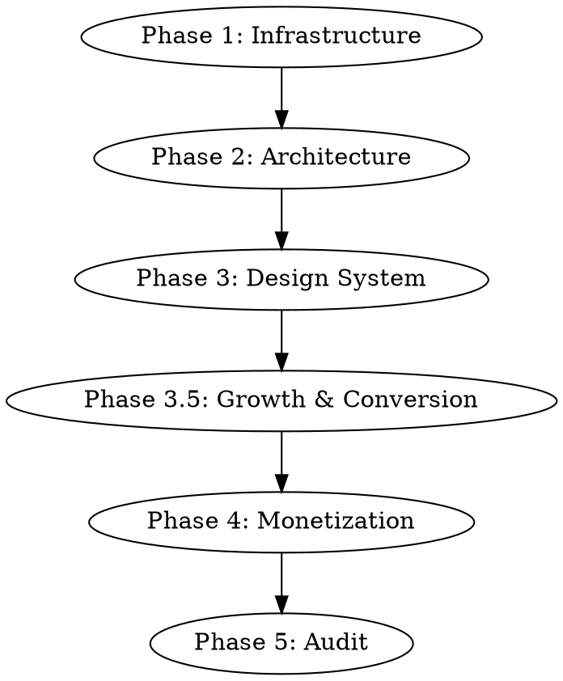

# Premium iOS Setup

Master orchestrator for transforming any iOS project into a premium, production-ready app. Walks through infrastructure, architecture, design system, monetization, and final audit.

## Prerequisites

Before starting, verify:
- Tuist installed (`tuist version`)
- Xcode with valid development team
- nova-canvas MCP configured (for Bedrock asset generation)
- Run `setup.sh` from this plugin if CLI tools are missing
- **Marketing skills plugin enabled:** Enable the `marketing-skills` plugin from this marketplace. These skills are invoked during Phase 3.5 for conversion optimization.

## Orchestration Flow

Follow these phases in order. Use sequential-thinking MCP for design decisions and `/axiom:ask` for iOS-specific guidance at each step.



---

## Phase 1 — Infrastructure Setup

### 1.1 Install Tuist Skills

Check if Tuist skills are installed. If not:
```
/find-skills tuist
```
Install: `using-tuist-generated-projects`, `migrating-to-tuist-generated-projects`

### 1.2 Setup Tuist Project

Use `/axiom:ask` to determine the right Tuist configuration for this project.

Create or update `Project.swift` and `Tuist/Package.swift` using the template in `references/tuist-config.md`. Key settings:
- `DEVELOPMENT_TEAM` in build settings (persists across generate)
- Automatic code signing
- All 6 SPM dependencies declared
- `UIAppFonts` in Info.plist for custom fonts
- StoreKit configuration file reference
- Tuist cache enabled

### 1.3 Configure CLAUDE.md

Add to the project's CLAUDE.md:
```
## Build Commands
- Install dependencies: tuist install
- Generate project: tuist generate
- Build: tuist build
- Test: tuist test
- Cache dependencies: tuist cache

Do NOT open .xcodeproj directly. Always use tuist generate first.
```

### 1.4 Verify

Run `tuist install && tuist generate` to confirm clean setup.

---

## Phase 2 — Architecture (MVI + Factory)

### 2.1 Detect Project State

Use sequential-thinking to evaluate:
- New project or existing?
- Current architecture pattern (if existing)?
- Number of screens/features?

### 2.2 Select DI Pattern

- **New projects:** Use Factory. See `references/mvi-pattern.md` for setup.
- **Existing projects:** Claude evaluates current DI and recommends migration path or coexistence.

### 2.3 Implement MVI

For each feature, create the 4-file structure. Use `/axiom:ask` for each architectural decision:

```
Feature/
├── FeatureModel.swift      # @Observable state
├── FeatureIntent.swift     # Actions + @Injected services
├── FeatureView.swift       # Pure SwiftUI
└── FeatureContainer.swift  # Wiring
```

See `references/mvi-pattern.md` for complete patterns and examples.

---

## Phase 3 — Premium Design System

This is the longest phase. Use sequential-thinking MCP extensively.

### 3.1 Create Design System Foundation

Use `/brainstorming` + sequential-thinking to define:
- Which theme preset fits the app category (serene/bold/vivid/custom)
- Color palette using SwiftUI-Design-System-Pro tokens
- Typography scale with custom Google Fonts

See `references/premium-design-system.md` for token reference.

Setup:
```swift
import DesignSystemPro

@main
struct MyApp: App {
    var body: some Scene {
        WindowGroup {
            DSApp {
                ContentView()
            }
        }
    }
}
```

### 3.2 Integrate Lottie + Pow

Use sequential-thinking to plan animation integration points:

**Lottie animations for:**
- Onboarding flow illustrations
- Loading states (replacing stock shimmer for hero sections)
- Success/error feedback
- Empty states
- Celebration moments (subscription purchase)

**Pow effects for:**
- Screen transitions: `.movingParts.blur`, `.movingParts.swoosh`
- Button feedback: `.changeEffect(.spray)`, `.changeEffect(.rise)`
- Card interactions: `.changeEffect(.glow)`
- Tab switching: `.transition(.movingParts.iris)`
- Delete/destructive: `.changeEffect(.shake)`

### 3.3 Custom Typography

Use the `google-font-downloader` skill to:
1. Download fonts from Google Fonts
2. Convert woff2 to ttf
3. Register in Tuist config (UIAppFonts)
4. Map to DesignSystemPro typography tokens via WhiteLabelConfiguration

### 3.4 Custom Icons + Illustrations (Bedrock)

**Icons first.** AI-coded apps rely heavily on SF Symbols and emojis. Premium apps use original artwork.

Use nova-canvas MCP to generate a complete custom icon set:
- Tab bar icons (NEVER use SF Symbols for these)
- Feature section icons
- Settings menu icons
- Generate ALL icons in one batch for visual consistency
- Only keep SF Symbols for system-standard actions (back arrow, share, search)

**Then illustrations.** Use sequential-thinking to plan illustration needs:
- Onboarding, empty states, headers, error states
- Include theme color palette in all prompts
- Cache with Nuke, display with LazyImage

**No emojis.** Never use emojis anywhere in the UI.

See `references/bedrock-assets.md` for prompt templates and `references/premium-design-system.md` for the complete iconography rules.

### 3.5 Humanize All Copy

Invoke `humanizer` to audit all in-app text (onboarding, empty states, error messages, button labels, paywall copy, App Store description) and remove AI writing patterns. The skill identifies 24 categories of AI-isms and rewrites them to sound natural. Run this AFTER writing all copy but BEFORE finalizing the design.

### 3.6 Navigation Transitions

Apply swiftui-navigation-transitions to NavigationStack:
```swift
import NavigationTransitions

NavigationStack {
    // ...
}
.navigationTransition(.slide(.horizontal))
```

---

## Phase 3.5 — Growth & Conversion (Marketing Skills)

These steps use skills from the `marketing-skills` plugin in this marketplace. Invoke each skill at the appropriate point.

### 3.6 Product Positioning

Invoke `product-marketing-context` to create the foundational positioning document:
- Target audience, personas, pain points
- Differentiation and competitive landscape
- Brand voice that aligns with the chosen design system theme

This document informs all subsequent marketing and UX decisions.

### 3.7 Onboarding Optimization

Invoke `onboarding-cro` to optimize the first-run experience:
- Permission request timing and framing
- Time-to-value optimization (quick wins)
- Habit loop design for retention
- Onboarding checklist patterns
- Apply marketing-psychology principles (endowment effect, IKEA effect)

### 3.8 Signup Flow

Invoke `signup-flow-cro` for mobile-specific signup optimization:
- Touch targets, keyboard types, autofill
- Social auth integration (Sign in with Apple, Google)
- Single-step vs multi-step evaluation
- Progressive profiling

### 3.9 Paywall Design

Invoke `paywall-upgrade-cro` to design the upgrade experience:
- Feature gate trigger points
- Paywall UI component hierarchy
- Timing and frequency rules
- Apply `marketing-psychology` principles (anchoring, social proof, scarcity, loss aversion)

### 3.10 Pricing Strategy

Invoke `pricing-strategy` to validate subscription tiers:
- Freemium vs trial evaluation
- Price anchoring across tiers
- Value metric alignment
- Regional pricing considerations

### 3.11 Churn Prevention

Invoke `churn-prevention` to design retention flows:
- Cancel flow with save offers (discount, pause, downgrade)
- Exit survey for insights
- Dunning for failed payments
- Health scoring for proactive intervention

### 3.12 Growth Mechanics

Invoke `referral-program` to design viral loops:
- Incentive structure (single/double-sided)
- In-app share mechanisms
- Trigger moments for referral prompts

### 3.13 A/B Testing Plan

Invoke `ab-test-setup` to plan experiments:
- Paywall variant tests
- Onboarding flow experiments
- Pricing display tests
- Sample size and statistical rigor

### 3.14 Launch/Relaunch Strategy

Invoke `launch-strategy` for phased rollout:
- TestFlight beta program
- Phased App Store release
- Launch marketing coordination

---

## Phase 4 — Monetization

### 4.1 StoreKit 2 Setup

Prompt user to create `.storekit` configuration file in Xcode if it does not exist.

Populate with subscription products and implement `StoreManager` with Factory DI. See `references/storekit-config.md` for complete implementation.

### 4.2 Paywall View

Build paywall using:
- DesignSystemPro DSCard for plan options
- Lottie animation for premium badge
- Pow celebration on purchase success
- Design system tokens for consistent styling

### 4.3 Tuist Completeness

Ensure all config is populated so `tuist generate` works without manual setup:
- Signing configuration
- Capabilities (In-App Purchase, etc.)
- Entitlements
- Build configurations (Debug, Release, Staging)
- All resource files referenced

---

## Phase 5 — Audit

### 5.1 Run Axiom Audit

```
/axiom:audit
```

This checks:
- Concurrency safety (Swift 6 readiness)
- Accessibility compliance (VoiceOver, Dynamic Type)
- Performance patterns (memory, energy)
- SwiftUI best practices
- Security and privacy

### 5.2 Final Verification

- `tuist generate && tuist build` succeeds
- All features follow MVI pattern
- Design system tokens applied consistently
- Lottie + Pow animations integrated
- StoreKit subscriptions testable
- No critical audit findings

---

## Quick Reference

| Dependency | Import | Key API |
|---|---|---|
| SwiftUI-Design-System-Pro | `import DesignSystemPro` | `DSApp`, `DSButton`, `DSCard`, `ColorTokens`, `SpacingScale` |
| Lottie | `import Lottie` | `LottieView`, `LottieAnimation` |
| Pow | `import Pow` | `.changeEffect()`, `.transition(.movingParts.*)` |
| Factory | `import Factory` | `@Injected`, `Container`, `Factory<T>` |
| Nuke | `import NukeUI` | `LazyImage`, `ImagePipeline` |
| NavigationTransitions | `import NavigationTransitions` | `.navigationTransition()` |
