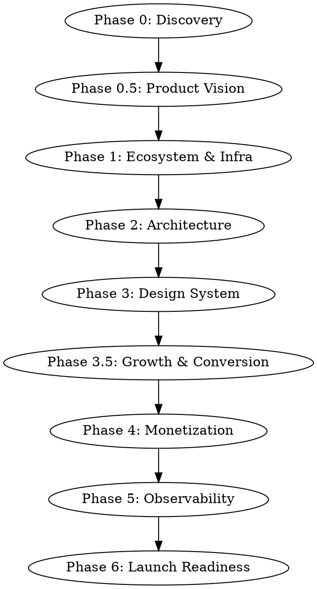

# Premium Next.js Setup

Master orchestrator for transforming any Next.js 16 project into a premium, production-grade web application. Walks through discovery, infrastructure, architecture, design system, growth, monetization, observability, and launch readiness.

Philosophy: "There is no later. AI later is 24 hours."

## Prerequisites

Before starting, verify:
- Node.js 18+ installed (`node --version`)
- Vercel CLI installed (`vercel --version`)
- AWS CLI configured for Bedrock (`aws bedrock list-foundation-models`)
- Run `setup.sh` from this plugin for BM25 dependencies
- **marketing-skills plugin enabled:** Required for Phase 3.5 conversion optimization skills
- **font-tools plugin enabled:** Required for Phase 3 premium typography

Discover additional skills:
```
/find-skills clerk sentry firebase responsive
```
Look for: `clerk-*`, `sentry-setup-*`, `firebase-*`, responsive design skills.

Verify MCP connections: `sequential-thinking`, `context7`, `next-devtools`, `better-icons`.

## Orchestration Flow

Follow these phases in order. Use sequential-thinking MCP for all major decisions.



---

## Phase 0 -- Discovery & Research

### 0.1 Environment Setup
Run `/find-skills` to discover available skills. Verify all MCP connections listed in Prerequisites.

### 0.2 Mode Fork
Ask: "Starting fresh or upgrading an existing project?"

### 0.3 Version Verification
Both modes: use firecrawl + context7 MCPs to verify latest stable versions of Next.js, React, Tailwind, shadcn/ui. Generate a version manifest pinning all dependencies.

### 0.4 Existing Project Audit (upgrade mode only)
Run Next.js DevTools MCP scan. Produce tech debt audit and migration plan using sequential-thinking.

---

## Phase 0.5 -- Product Marketing Context + Brainstorming + Nova Assets

Invoke `product-marketing-context` to establish positioning, audience, and brand voice.
Invoke `superpowers:brainstorming` for product vision exploration.
Use sequential-thinking MCP to align product vision with technical decisions.

Generate Nova assets early (logo, hero image, OG images) -- see `references/nova-assets.md`.
Establish iconography direction: better-icons MCP for standard UI icons, Nova for custom brand artwork.

---

## Phase 1 -- Ecosystem Decision + Infrastructure + CMS

### 1.1 Ecosystem Decision
Evaluate: Composable (Clerk + Neon + Upstash) vs Supabase vs Firebase. See `references/scaling-cost-matrix.md`.

### 1.2 CMS Decision
Evaluate: Payload CMS vs Sanity vs TinaCMS. See `references/cms-content-link.md`.

### 1.3 Turborepo Scaffold
See `references/turborepo-config.md`. Create monorepo structure:
- `apps/web` -- Next.js 16 app
- `packages/api` -- tRPC or REST API layer
- `packages/db` -- Drizzle ORM + migrations
- `packages/ui` -- shared component library
- `packages/billing` -- payment abstraction
- `packages/email` -- transactional email templates
- `packages/notifications` -- push + in-app notifications

Run `vercel link` and `vercel env pull` to connect deployment. Verify Vercel deployment succeeds.

### 1.4 Write CLAUDE.md Agent Guardrails
Add build commands, service layer rules, and forbidden patterns. See `references/service-layer-pattern.md`.

---

## Phase 2 -- Architecture + Multi-Tenant + Event Bus

### 2.1 Multi-Tenant Strategy
Row-level isolation vs schema-per-tenant vs database-per-tenant. See `references/architecture-decisions.md`.

### 2.2 Service Layer Pattern
All business logic in services, never in route handlers or server actions directly. See `references/service-layer-pattern.md`.

### 2.3 Inngest Event Bus
Set up Inngest for background jobs, scheduled tasks, and event-driven workflows.

### 2.4 Realtime + Push
WebSocket strategy (Ably/Pusher/Supabase Realtime) + web push notifications. See `references/realtime-push.md`.

### 2.5 Search Infrastructure
Evaluate: Algolia vs Typesense vs Meilisearch vs pg_trgm. See `references/architecture-decisions.md`.

### 2.6 Architecture Framework
Monolith vs microservices, microfrontend evaluation. See `references/architecture-decisions.md`.

### 2.7 API Documentation
tRPC Panel for internal APIs, OpenAPI spec generation for public APIs.

---

## Phase 3 -- Premium Design System + Nova Assets

### 3.1 BM25 Design Search
Run BM25 design search with the product description to find relevant design inspiration and patterns.

### 3.2 Design Tokens
Generate shadcn/ui + Tailwind v4 theme tokens (colors, spacing, typography, radius). See `references/premium-design-system.md`.

### 3.3 Asset Generation
See `references/nova-assets.md` for prompt templates.
- **UI icons:** better-icons MCP -- choose ONE icon collection for consistency
- **Brand assets:** Nova for custom icons, illustrations, and marketing visuals
- **Fonts:** Invoke `google-font-downloader` skill for premium typography

### 3.4 Component Architecture
Build shared component library in `packages/ui/`. See `references/premium-design-system.md` for token integration, variant patterns, and composability rules.

### 3.5 Humanize All Copy
Invoke `humanizer` on all AI-generated copy -- onboarding, empty states, error messages, CTAs, marketing pages. Run AFTER writing copy, BEFORE finalizing design.

---

## Phase 3.5 -- Growth & Conversion + Email Marketing

Invoke marketing-skills in sequence:
`product-marketing-context` (from 0.5) -> `onboarding-cro` -> `signup-flow-cro` -> `paywall-upgrade-cro` -> `pricing-strategy` -> `churn-prevention` -> `referral-program` -> `ab-test-setup` -> `launch-strategy`

All copy through humanizer. All visuals Nova-generated.

Email marketing setup: Resend + React Email for transactional and drip campaigns. See `references/email-marketing.md`.

User data syncing via Clerk webhooks to CRM and email lists.

---

## Phase 4 -- Monetization + Billing

### 4.1 Billing Setup
See `references/billing-abstraction.md`. Implement in `packages/billing/`:
- Stripe adapter (default)
- Clerk Billing adapter (optional)
- Custom adapter interface for future providers

### 4.2 Transactional Email
Resend + React Email templates in `packages/email/`. Receipts, trial expiry, dunning, welcome sequences.

---

## Phase 5 -- Observability + Audit

See `references/observability-stack.md`.

Invoke: `sentry-setup-logging`, `sentry-setup-tracing`, `sentry-setup-metrics`.

Additional observability:
- PostHog for product analytics and feature flags
- Vercel Analytics + Speed Insights
- Performance audit: bundle analysis with `@next/bundle-analyzer`
- Lighthouse CI in GitHub Actions

---

## Phase 6 -- Launch Readiness

Final checklist before shipping:
- **Security:** env vars audited, CORS configured, rate limiting via Upstash
- **SEO:** metadata API, dynamic OG images, sitemap.xml, robots.txt
- **Accessibility:** WCAG 2.1 AA compliance verified
- **Performance:** Core Web Vitals passing (LCP < 2.5s, INP < 200ms, CLS < 0.1)
- **API:** OpenAPI spec published, tRPC panel accessible in dev
- **CI/CD:** preview deployments per PR, staging environment configured
- **CMS:** Content Link + draft mode verified (see `references/cms-content-link.md`)
- **Push:** web push notifications tested end-to-end
- **Realtime:** cache invalidation and live updates verified
- **Launch:** invoke `launch-strategy` skill for phased rollout plan

---

## Quick Reference

| Layer | Tool | Package | Key API |
|---|---|---|---|
| Framework | Next.js 16 | `next` | App Router, Server Actions, `generateMetadata` |
| Styling | Tailwind v4 | `tailwindcss` | `@theme`, CSS variables, `cn()` utility |
| Components | shadcn/ui | `@shadcn/ui` | `Button`, `Card`, `Dialog`, `Sheet`, `Tabs` |
| Auth | Clerk | `@clerk/nextjs` | `auth()`, `currentUser()`, `<SignIn />` |
| Database | Drizzle ORM | `drizzle-orm` | `db.select()`, `db.insert()`, schema definitions |
| API | tRPC | `@trpc/server` | `router`, `procedure`, `createCallerFactory` |
| Billing | Stripe | `stripe` | `stripe.checkout.sessions`, `stripe.subscriptions` |
| Email | Resend | `resend` | `resend.emails.send()`, React Email templates |
| Events | Inngest | `inngest` | `inngest.createFunction()`, `inngest.send()` |
| Analytics | PostHog | `posthog-js` | `posthog.capture()`, feature flags |
| Monitoring | Sentry | `@sentry/nextjs` | `Sentry.captureException()`, tracing |
| Hosting | Vercel | `vercel` | `vercel deploy`, preview URLs, env vars |
